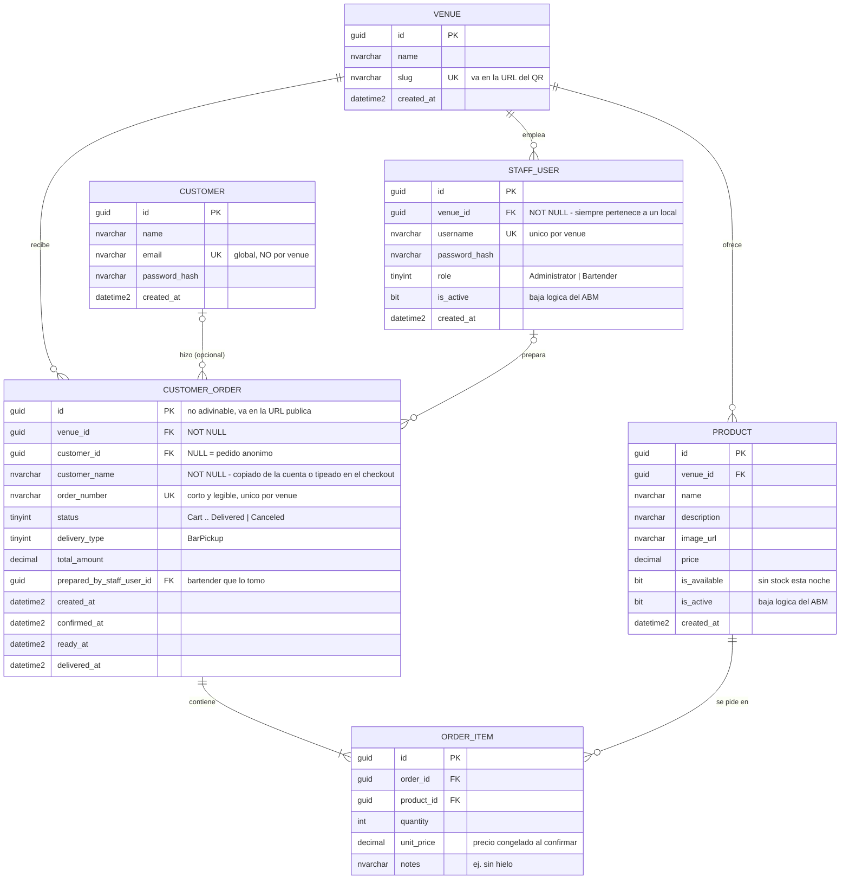
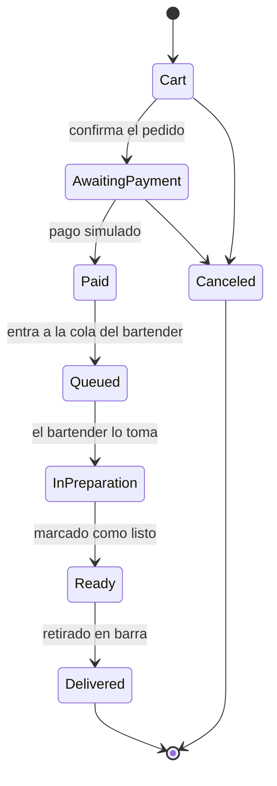

# Modelo de datos — Sprint 1

Modelo acotado al alcance del [Sprint 1](sprints/sprint-1.md). Las entidades del diseño
funcional que quedan fuera están listadas al final, con el motivo de cada una.

## Diagrama entidad-relación

## Máquina de estados de `CustomerOrder`

En el Sprint 1 los pagos se simulan con un cambio de estado, como habilita la consigna.
La máquina de estados es la misma del diseño funcional §5, así que no hay que rehacerla
cuando entre la pasarela real.

**`Canceled` sólo se alcanza desde `Cart` y `AwaitingPayment`.** Es una regla de negocio:
los pedidos pagos **no se devuelven**, en ningún método de pago. Como `Queued`,
`InPreparation` y `Ready` exigen haber pasado por `Paid`, la única ventana de cancelación
queda antes del pago — y conviene que la máquina de estados lo haga imposible por
construcción, en vez de dejarlo librado a un `if` en la capa de aplicación que alguien
puede olvidar.

El corte además elimina trabajo que no vamos a hacer: sin devoluciones no hace falta una
pantalla de reintegro en la caja, ni integrar *refunds* con la pasarela (que cobra comisión
por devolver), ni un reintegro al saldo de la mesa VIP cuando esa parte entre.

La cancelación automática por *timeout* de un pedido en efectivo nunca pagado usa esta
misma transición desde `AwaitingPayment`; falta definir a los cuántos minutos (§15).

Queda **sin modelar** el caso inverso: que el local no pueda entregar un pedido ya pagado
(se acabó el trago, cierra la estación). No es una cancelación del cliente, la plata ya se
cobró, y necesita su propia decisión de producto.

## Decisiones de modelado

**Dos tablas de identidad, no una.** `STAFF_USER` es empleado de un local y lleva `venue_id`
obligatorio; `CUSTOMER` es una persona que puede pedir en cualquier local y no
pertenece a ninguno.

Si fueran una sola tabla, `venue_id` tendría que admitir `NULL`, y ahí se rompe el *global
query filter* de EF Core que aplica el filtro por boliche automáticamente: o filtra estricto
y los clientes desaparecen de toda consulta, o contempla el `NULL` y entonces las consultas
de personal interno pueden traer clientes, con lo que el aislamiento entre locales deja de
ser verificable. Además el enum de roles pasaría a mezclar `Customer` con roles internos,
que no son la misma clase de cosa.

El costo de separarlas: si una misma persona fuera bartender en un local y cliente en otro,
tendría dos cuentas. Si eso llega a importar, se parten credenciales de perfiles
(`UserCredential` + `StaffProfile` + `CustomerProfile`), pero eso agrega un join en cada
autenticación para resolver un caso que puede no ocurrir nunca.

**Quién es el cliente: `customer_id` nullable + `customer_name` obligatorio.** Son dos campos
que parecen redundantes y no lo son.

`customer_id` en `NULL` es un pedido anónimo, que es lo que pide la consigna: *"los clientes
podrán pedir sin crear una cuenta permanente"*.

`customer_name` está **siempre** cargado, esté logueado el cliente o no. Si tiene cuenta se
copia de ella al confirmar; si no, sale del input del checkout. Es un snapshot, por la misma
razón que `unit_price`: si mañana esa persona edita su nombre en la cuenta, el pedido de
anoche tiene que seguir mostrando el nombre con el que se entregó. Y hay una razón práctica
igual de importante: la pantalla del bartender lee **un solo campo**, sin un `if` sobre si
hay cuenta o no, y sin un LEFT JOIN con COALESCE en la consulta de la cola.

**El nombre no es autenticación.** La credencial real de la entrega es el QR, que lleva el
GUID no adivinable del pedido. `customer_name` es una ayuda humana para cantar el pedido en
la barra —"¿Pablo?"— y para cuando el lector falla o el celular no tiene batería. No hay que
construir la entrega sobre una búsqueda por nombre: dos personas se llaman igual la misma
noche, y el nombre lo tipea el propio cliente sin que nadie lo valide.

**`unit_price` congelado en `ORDER_ITEM`.** Si el precio saliera por join a `PRODUCT`, subir
el precio de un trago cambiaría el total de todos los pedidos ya cerrados. Se guarda el
precio del momento de la confirmación.

**`id` y `order_number` separados en `CUSTOMER_ORDER`.** La consigna pide un número de
pedido y una pantalla pública de seguimiento. Si el número corto fuera la clave de esa URL,
cualquiera podría escribir `/pedido/1024` y ver pedidos ajenos. Entonces: `order_number` es
lo que se muestra al cliente, y `id` —un GUID no adivinable— es lo que va en la URL.

**`venue_id` en todo lo que pertenece a un local.** El sistema es multi-tenant desde el día
uno ([ADR-0004](adr/)). No lo pide la consigna, pero agregarlo después obliga a migrar datos
reales y a rehacer todos los índices únicos. Notar que `username`, `slug` y `order_number`
son únicos **por venue**, no globales: dos boliches tienen que poder tener un "Pedido 1".
`CUSTOMER` es la excepción deliberada: su `email` es único a nivel plataforma.

**`is_active` separado de `is_available`.** La consigna pide ABM de productos y también
disponibilidad. Son cosas distintas: `is_available` es "se acabó el gin esta noche" y
`is_active` es la baja lógica del ABM. Nunca se borra físicamente un producto, porque los
`ORDER_ITEM` históricos lo referencian.

**`role` como columna, no como tabla.** Con dos roles, una tabla `Role` con su join agrega
tres joins a cada consulta de permisos sin ganar nada. Si aparecen roles configurables por
el administrador, se normaliza en ese momento.

**`CUSTOMER_ORDER` y no `ORDER`.** `ORDER` y `USER` son palabras reservadas en SQL Server y
obligan a escribir `[Order]` en cada consulta escrita a mano.

## Fuera del alcance del Sprint 1

Está en el diseño funcional y **se modela más adelante**, no ahora:

| Entidad | Por qué se posterga |
|---|---|
| `Table`, `VipAccount` | El Sprint 1 es sólo retiro en barra. |
| `PushSubscription` | Las notificaciones se simulan con cambios de estado. |
| `BarStation` | Una sola barra en el MVP; el KDS no se reparte por estación. |
| `PaymentMethod`, pasarela | El pago se simula. |
| Rol `Cashier`, rol `Waiter` | La consigna fija Administrador y Bartender. |

Caso aparte, `CUSTOMER`: **la tabla está en el modelo, el login no se construye todavía.**
La consigna pide explícitamente que el cliente pueda pedir sin cuenta y sólo exige
autenticación para los roles internos, así que el registro y el login de clientes se
implementan cuando se pidan. La tabla y la FK nullable quedan desde ahora porque no cuestan
nada.

Ojo con la confusión: **`customer_name` sí es del Sprint 1**. En este sprint todos los
pedidos son anónimos, así que el input de nombre en el checkout es lo único que identifica
a quién retira, junto con el QR.
